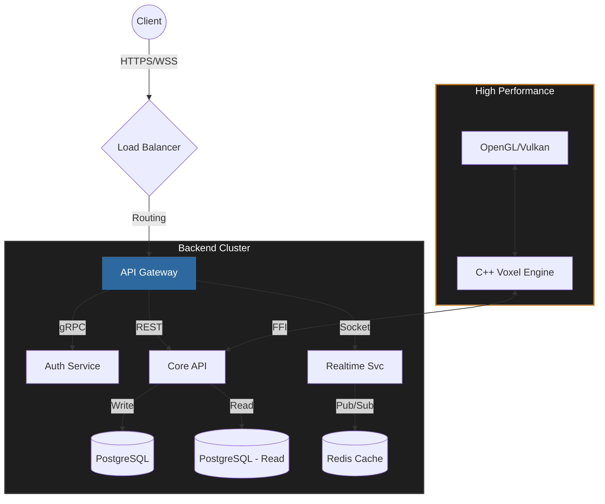

# `class Krupanjac extends SoftwareEngineer`

```typescript
/**
 * Arsen Đurđev (Krupanjac)
 * Fullstack Systems Architect & Performance Engineer
 */
interface EngineerProfile {
    core: {
        languages: ["TypeScript", "C++", "Python", "Go"];
        backend: ["Node.js", "Microservices", "gRPC", "PostgreSQL"];
        systems: ["OpenGL", "Memory Optimization", "Multi-threading"];
        frontend: ["React", "Next.js", "WebGL"];
    };
    focus: "Building scalable, high-performance distributed systems";
    status: "Compiling...";
}

const me: EngineerProfile = {
    // ...initializing dependencies
};
```

### 📡 System Architecture



### 🛠️ Technology Stack

| Domain | Technologies |
|:--- |:--- |
| **Backend & Cloud** |      |
| **Systems & Native** |     |
| **Frontend & Web** |     |

### 📊 Repository Analytics

<div align="left">
  
  
</div>

### 💾 Selected Works

```json
[
  {
    "project": "minecraft-cpp",
    "type": "Game Engine",
    "stack": ["C++", "OpenGL", "GLSL"],
    "description": "High-performance voxel rendering engine with custom memory allocators."
  },
  {
    "project": "gyst-ecosystem",
    "type": "Fullstack Platform",
    "stack": ["Node.js", "TypeScript", "Swift"],
    "description": "Distributed backend systems for mobile application synchronization."
  }
]
```

<!-- Footer -->
<div align="right">
  <code>echo "contact: linked/in/krupanjac" >> /dev/null</code>
</div>