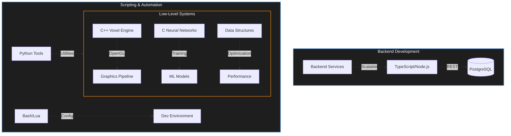

# `class Krupanjac extends SoftwareEngineer`

```typescript
/**
 * Arsen Đurđev (Krupanjac)
 * Systems Architect • Backend Engineer • Performance Specialist
 */
interface EngineerProfile {
    core: {
        languages: ["C++", "C", "C3", "TypeScript", "Python"];
        systems: ["OpenGL", "Voxel Engines", "Memory Optimization", "Multi-threading"];
        backend: ["Node.js", "TypeScript", "PostgreSQL", "REST APIs"];
        algorithms: ["Binary Search Trees", "Fibonacci Heaps", "B* Trees", "Graph Algorithms"];
    };
    focus: "Building high-performance systems from the ground up";
    status: "Compiling...";
}
```

**[`krupanjac.dev`](https://krupanjac.dev)** • **[`linkedin/arsendjurdjev`](https://linkedin.com/in/arsendjurdjev)**

---

## 📡 Technical Focus



## Overview

Backend engineer specializing in high-performance systems, algorithms, and low-level programming. Focused on building efficient software from the ground up—game engines, neural networks, and scalable backend architectures.

## Core Technologies

```
Systems     →  C++, C, C3, OpenGL, Multi-threading, Memory Optimization
Backend     →  TypeScript, Node.js, PostgreSQL, REST APIs
Algorithms  →  BST, Fibonacci Heaps, B* Trees, Graph Algorithms
Tools       →  Python, Lua, Bash, Neovim, Git
```

## 🛠️ Technology Stack

| Domain | Technologies |
|:--- |:--- |
| **Systems & Graphics** |     |
| **Backend & Web** |    |
| **Scripting & Tools** |    |

## 📊 Repository Analytics

<div align="left">
  
  
</div>

## Notable Projects

### [`minecraft-cpp`](https://github.com/Krupanjac/minecraft-cpp)
Voxel engine built from scratch in C++ using OpenGL. Features advanced chunk management, optimized rendering pipeline, and high FPS performance.

**Tech:** C++20, OpenGL, GLSL, CMake

### [`xor-neural-network-in-c`](https://github.com/Krupanjac/xor-neural-network-in-c)
Neural network implementation from scratch without ML libraries. Demonstrates gradient descent, backpropagation, and numerical differentiation.

**Tech:** C, Machine Learning

### [`counter-strike-cpp`](https://github.com/Krupanjac/counter-strike-cpp)
Game development project showcasing systems programming, game physics, and rendering techniques.

**Tech:** C++, Game Development

### Data Structures & Algorithms
- **[`Bstar-database-search`](https://github.com/Krupanjac/Bstar-database-search)** — B* tree implementation for database indexing
- **[`Fibonacci-Heap-Inventory-System`](https://github.com/Krupanjac/Fibonacci-Heap-Inventory-System)** — Max/min heap implementation
- **[`contactbook-BST`](https://github.com/Krupanjac/contactbook-BST)** — Binary search tree with self-organizing lists
- **[`direct-k-way`](https://github.com/Krupanjac/direct-k-way)** — K-way merge iterator

### Backend & Tools
- **[`moneta`](https://github.com/Krupanjac/moneta)** — Financial tracking system with TypeScript/React
- **[`CLI`](https://github.com/Krupanjac/CLI)** — C++ command-line interface framework
- **[`nvim-conf`](https://github.com/Krupanjac/nvim-conf)** — Personal Neovim configuration

---

<div align="center">

**Built with**      

</div>