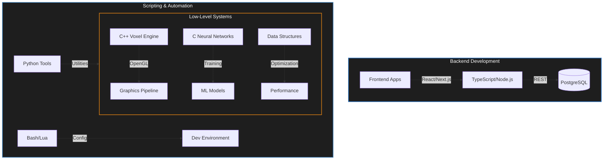

# `class Krupanjac extends SoftwareEngineer`

```typescript
/**
 * Arsen Đurđev (Krupanjac)
 * Fullstack Systems Architect & Performance Engineer
 */
interface EngineerProfile {
    core: {
        languages: ["C++", "C", "Python", "TypeScript"];
        systems: ["OpenGL", "Voxel Engines", "Memory Optimization", "Multi-threading"];
        backend: ["Node.js", "TypeScript", "PostgreSQL"];
        frontend: ["React", "Next.js", "HTML/CSS", "JavaScript"];
    };
    focus: "Building high-performance systems and game engines from scratch";
    status: "Compiling...";
}

const me: EngineerProfile = {
    // ...initializing dependencies
};
```

### 📡 Technical Focus



### 🛠️ Technology Stack

| Domain | Technologies |
|:--- |:--- |
| **Systems & Graphics** |     |
| **Backend & Web** |    |
| **Scripting & Tools** |    |
| **Frontend** |     |

### 📊 Repository Analytics

<div align="left">
  
  
</div>

### 💾 Selected Works

```json
[
  {
    "project": "minecraft-cpp",
    "type": "Voxel Engine",
    "stack": ["C++", "OpenGL", "GLSL"],
    "description": "Minecraft-like voxel engine built from scratch with advanced rendering and chunk management."
  },
  {
    "project": "xor-neural-network-in-c",
    "type": "Machine Learning",
    "stack": ["C", "Neural Networks"],
    "description": "XOR neural network implementation from scratch in C without ML libraries."
  },
  {
    "project": "counter-strike-cpp",
    "type": "Game Engine",
    "stack": ["C++", "Game Dev"],
    "description": "Counter-Strike inspired game project showcasing systems programming."
  }
]
```

<!-- Footer -->
<div align="right">
  <code>echo "contact: linked/in/krupanjac" >> /dev/null</code>
</div>