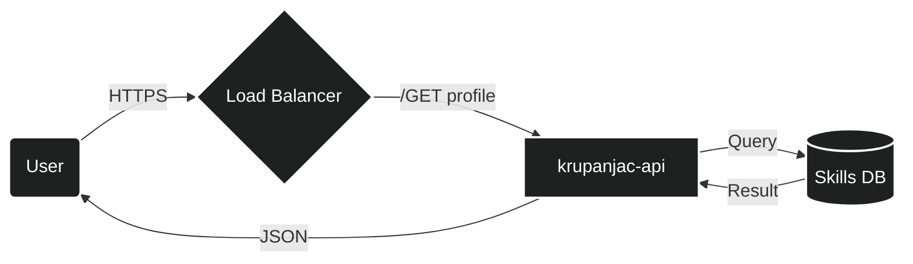

# `~/krupanjac`

```bash
$ ./whoami.sh
> Initializing backend services...
> Loading profile... 100%
```

### 📡 System Architecture



### 💾 HTTP Response

```http
HTTP/1.1 200 OK
Content-Type: application/json
X-Powered-By: Coffee
Date: Mon, 01 Jan 2026 12:00:00 GMT
```

```json
{
  "data": {
    "id": "krupanjac",
    "type": "Backend Engineer",
    "attributes": {
      "intelligence": "Artificial & Natural",
      "languages": ["Python", "Go", "Rust", "SQL"],
      "infrastructure": ["Docker", "Kubernetes", "AWS", "Linux"],
      "database": ["PostgreSQL", "Redis", "MongoDB"],
      "status": "Building scalable systems",
      "location": "127.0.0.1"
    },
    "links": {
      "github": "https://github.com/krupanjac",
      "linkedin": "https://linkedin.com/in/krupanjac"
    }
  }
}
```

### 🛠️ `sudo apt-get install skills`


### 📝 `tail -f /var/log/dev.log`

```diff
+ 🔭 I’m currently working on High availability distributed systems
+ 🌱 I’m currently learning eBPF and Kernel tuning
+ 👯 I’m looking to collaborate on Open Source Backend Tooling
! ⚡ Fun fact: I dream in JSON.
```

<details>
<summary><b>🛑 sudo systemctl status motivation</b></summary>

```ini
● motivation.service - Daily Coding Drive
   Loaded: loaded (/lib/systemd/system/motivation.service; enabled; vendor preset: enabled)
   Active: active (running) since Mon 2026-01-01 08:00:00 UTC; 4h 20min ago
 Main PID: 1337 (brain)
    Tasks: 42 (limit: 4915)
   Memory: 99.9%
   CGroup: /system.slice/motivation.service
           └─1337 /usr/bin/brain --focus=backend --coffee=true
```
</details>

---
```console
krupanjac@github:~$ exit
logout
Connection to localhost closed.
```
