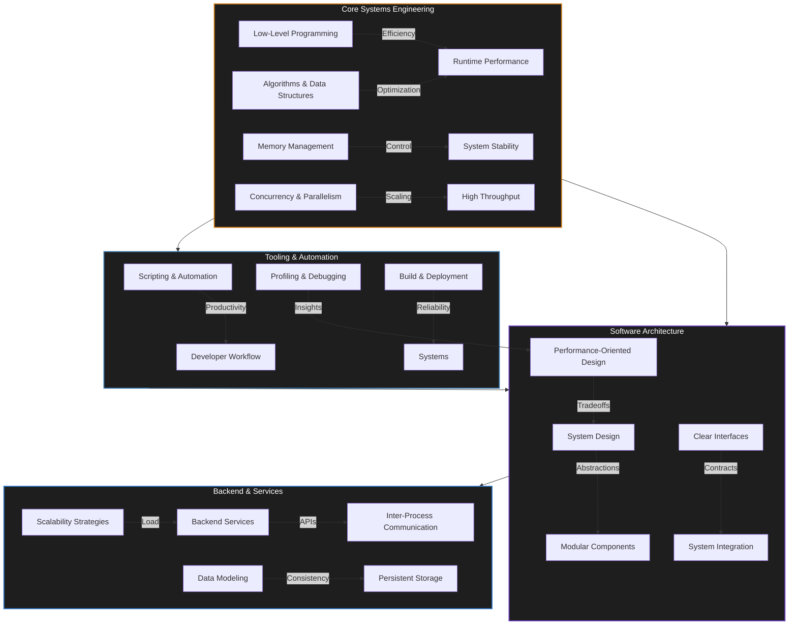

# `class Krupanjac extends SoftwareEngineer`

```typescript
/**
 * Arsen Đurđev (Krupanjac)
 * Software Engineer — Systems, Architecture, Performance
 */
interface EngineerProfile {
    foundation: {
        paradigm: ["Low-Level Systems", "Abstraction-Oriented Design", "Performance Engineering"];
        principles: ["Correctness", "Efficiency", "Scalability", "Maintainability"];
    };

    competencies: {
        systems: "Resource-aware, deterministic software";
        architecture: "Composable, modular, and evolvable systems";
        backend: "Reliable services and data-driven applications";
        algorithms: "Data structures and algorithmic optimization";
    };

    focus: "Designing and building efficient systems from first principles";
    mindset: "Understand the machine, control the system";
    status: "Compiling...";
}

```

**[`krupanjac.dev`](https://krupanjac.dev)** • **[`linkedin/arsendjurdjev`](https://linkedin.com/in/arsendjurdjev)**

---

## `class TechnicalFocus : public Krupanjac`



## `class Overview : Krupanjac`

Software engineer specializing in high-performance systems, algorithms, and low-level programming. Focused on building efficient software from the ground up—game engines, neural networks, and scalable backend architectures.

## `class CoreTechnology : Overview`

```
Systems Engineering   →  Low-level programming, memory models, concurrency, performance tuning
Architecture          →  Modular design, clear interfaces, abstraction boundaries
Backend Systems       →  Service design, data modeling, API-driven systems
Algorithms            →  Data structures, complexity analysis, optimization techniques
Tooling & Workflow    →  Automation, debugging, profiling, build systems

```

## `class TechnologyStack : Overview`

| Domain | Technologies |
|:--- |:--- |
| **Systems** |      |
| **Web** |      |
| **Databases** |    |
| **Scripting** |    |
| **OS** |  |

## `class RepositoryAnalytics : Krupanjac`


## Notable Projects

### [`minecraft-cpp`](https://github.com/Krupanjac/minecraft-cpp)
Voxel engine built from scratch in C++ using OpenGL. Features advanced chunk management, optimized rendering pipeline, and high FPS performance.

**Tech:** C++20, OpenGL, GLSL, CMake

### [`xor-neural-network-in-c`](https://github.com/Krupanjac/xor-neural-network-in-c)
Neural network implementation from scratch without ML libraries. Demonstrates gradient descent, backpropagation, and numerical differentiation.

**Tech:** C, Machine Learning

### [`counter-strike-cpp`](https://github.com/Krupanjac/counter-strike-cpp)
Game development project showcasing systems programming, game physics, and rendering techniques.

**Tech:** C++, Game Development

### Data Structures & Algorithms
- **[`Bstar-database-search`](https://github.com/Krupanjac/Bstar-database-search)** — B* tree implementation for database indexing
- **[`Fibonacci-Heap-Inventory-System`](https://github.com/Krupanjac/Fibonacci-Heap-Inventory-System)** — Max/min heap implementation
- **[`contactbook-BST`](https://github.com/Krupanjac/contactbook-BST)** — Binary search tree with self-organizing lists
- **[`direct-k-way`](https://github.com/Krupanjac/direct-k-way)** — K-way merge iterator

### Backend & Tools
- **[`moneta`](https://github.com/Krupanjac/moneta)** — Financial system with TypeScript/Angular
- **[`CLI`](https://github.com/Krupanjac/CLI)** — C++ command-line interface framework
- **[`nvim-conf`](https://github.com/Krupanjac/nvim-conf)** — Personal Neovim configuration

---
