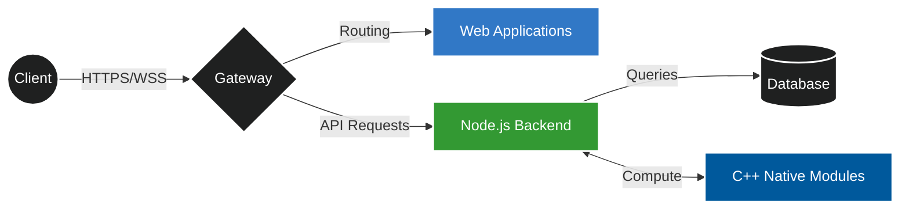

# `~/krupanjac`

```bash
$ ./whoami.sh
> Booting up core systems...
> Loading C++ modules... OK
> Initializing TypeScript runtime... OK
> Mounting Node.js backend services... OK
> User profile loaded: Active
```

### 📡 Architecture



### 💾 API Response

```http
HTTP/1.1 200 OK
Content-Type: application/json
Server: krupanjac-engine/v1.0
Date: Thu, 01 Jan 2026 12:00:00 GMT
```

```json
{
  "user": {
    "handle": "krupanjac",
    "role": "Fullstack & Systems Engineer",
    "stack": {
      "languages": ["C++", "TypeScript", "JavaScript", "Python", "GLSL"],
      "backend": ["Node.js", "REST/GraphQL", "Microservices"],
      "frontend": ["HTML5/SCSS", "Modern Web Frameworks"],
      "systems": ["OpenGL", "Memory Management", "Performance Optimization"]
    },
    "current_focus": {
      "project": "minecraft-cpp",
      "description": "Voxel engine from scratch using C++ & OpenGL",
      "status": "Optimizing rendering pipeline"
    },
    "links": {
      "github": "https://github.com/krupanjac",
      "portfolio": "https://github.com/Krupanjac/arsen-portfolio-2025"
    }
  }
}
```

### 🛠️ `apt list --installed`


### 📝 `tail -f /var/log/syslog`

```diff
+ [INFO] Developing high-performance voxel engine in C++
+ [INFO] Building scalable backend architectures with Node.js
+ [INFO] Crafting responsive web interfaces with TypeScript
! [WARN] Coffee levels critical: Refill required
```

<details>
<summary><b>⚙️ systemctl status dev-daemon</b></summary>

```ini
● dev-daemon.service - Main Development Loop
   Loaded: loaded (/etc/systemd/system/dev-daemon.service; enabled)
   Active: active (running) since Mon 2018-01-01 00:00:00 UTC
 Main PID: 8080 (krupanjac)
    Tasks: 64 (limit: 32768)
   Memory: 16GB
   CGroup: /user.slice/dev-daemon.service
           ├─8080 /usr/bin/node server.js --env=production
           └─8081 /usr/bin/main_engine --render=opengl
```
</details>

---
```console
root@krupanjac:~# echo "Let's build something."
Let's build something.
root@krupanjac:~# logout
```
